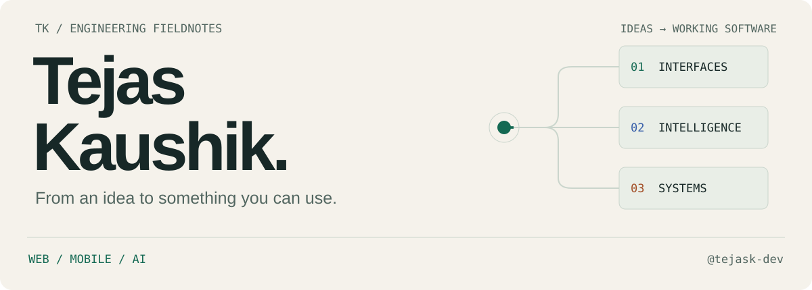

<picture>
  <source media="(prefers-color-scheme: dark)" srcset="assets/profile/hero-dark.svg">
  <source media="(prefers-color-scheme: light)" srcset="assets/profile/hero-light.svg">
  
</picture>

# Tejas Kaushik

I build web and mobile products, with a focus on learning tools, AI applications, and the systems behind them.

**Founding Software Engineer at Anticipation Labs.** Computer Science at Western University with Ivey Advanced Entry Opportunity (AEO), intending to pursue the Computer Science/Ivey HBA dual-degree pathway.

[Portfolio](https://tejass-kaushik.vercel.app/) · [LinkedIn](https://www.linkedin.com/in/tejasskaushik/) · [GitHub](https://github.com/tejask-dev) · [Email](mailto:tejs.kaushik@outlook.com)

## Current work

**Anticipation Labs · 2026–present**

Anticipation Labs is building [Anticipy](https://www.anticipy.ai/), an AI pendant designed to turn spoken intentions into actions with the wearer's approval.

I built and shipped the **Anticipy Fellowship website and application experience**, shaping the candidate journey across Software, Hardware, and Growth/Marketing tracks. My work covered the application flows and deployment to **Cloudflare Workers**, with automatic deployment from Git. I also contribute to recruiting infrastructure and early-stage operations.

## Selected work

### ACS Can Drive

A full-stack platform for a school-wide food drive. I built tools for donation leaderboards, roster imports, class-buyout tracking, and street reservations so organizers could coordinate collection in one place. The platform supported a campaign that collected **27,000+ cans**. A React and TypeScript frontend connects to a FastAPI backend for campaign records, imports, and reporting.

[ACS Can Drive repository](https://github.com/tejask-dev/ACS_CanDrive-WebApp)

### ModelMind

An AI-assisted spreadsheet analysis prototype built during my DocuBridge internship. I developed natural-language questions over Excel and CSV data, alongside structured analysis, charts, and summaries. The implementation pairs a React interface with Flask and Pandas, connecting file processing and LLM APIs in a single analysis workflow.

[DocuBridge internship repository](https://github.com/tejask-dev/Docubridge-Intership)

### MoleculeAI

An organic chemistry application for moving between molecule drawings, names, and interactive structures. I built drawing and name-to-structure workflows, functional-group detection, and 3D visualization. The chemistry layer uses **RDKit** for structure analysis and **PubChem** for compound lookup, with a React interface for exploring the results.

[MoleculeAI repository](https://github.com/tejask-dev/OrganicChem-WebApp) · [MoleculeAI interface](https://organic-chem-web-app.vercel.app/)

### PromMatch

An AI-assisted student matchmaking platform. I developed profile and questionnaire flows with ranked recommendations and mutual matches. Its matching system combines weighted questionnaire compatibility with optional semantic similarity from embeddings, using **PostgreSQL and pgvector** alongside a FastAPI backend. This gives the matching process both structured preferences and a way to compare free-text responses.

[PromMatch repository](https://github.com/tejask-dev/PromMatch)

## Previous experience

### Stellar Learning

**Former Chief Technology Officer, previously Deputy CTO · August 2025–July 2026**

[Stellar](https://stellarlearning.app/) is a free learning and exam-preparation platform reporting **40,000+ learners**. I contributed to platform architecture and product development across web, mobile, and AI-enabled learning, including practice systems and the Nova AI tutoring experience.

My web work involved React, Next.js, Firebase, and Redis. On mobile, I worked with Flutter, Riverpod, GoRouter, Dio, and streaming interfaces. I also coordinated technical work within a distributed volunteer organization.

### Alti AI

**Software Engineering / AI Product Intern · October 2025–April 2026**

Worked on Alti Assistant and Alti Agent, with safety and guardrail work on Alti Guard.

### DocuBridge

**Software Engineering / AI Development Intern · July–August 2025**

Developed [ModelMind](#modelmind), the spreadsheet analysis prototype featured above.

## Technical capabilities

- **Product engineering:** React and TypeScript interfaces, Python APIs with FastAPI and Flask, and Flutter mobile applications.
- **AI and data:** LLM integrations, embedding-based matching, spreadsheet processing with Pandas, and chemistry tooling with RDKit.
- **Infrastructure:** Cloudflare Workers deployment, Git-based delivery, Firebase, Redis, and relational data with PostgreSQL.

## Beyond the code

I founded a web and software venture through Ontario's Summer Company program, delivering client projects from scoping through development and deployment. That work put client conversations and delivery responsibilities alongside the engineering.

## Get in touch

For engineering opportunities, technical collaborations, or a conversation about something you're building, reach me at [tejs.kaushik@outlook.com](mailto:tejs.kaushik@outlook.com) or connect on [LinkedIn](https://www.linkedin.com/in/tejasskaushik/).
