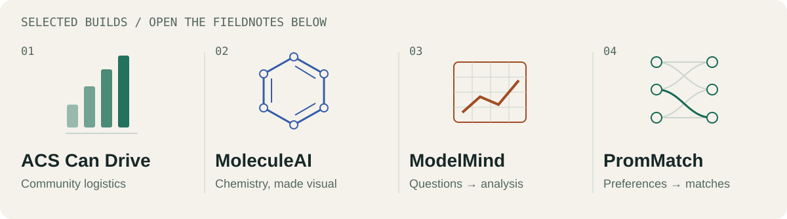
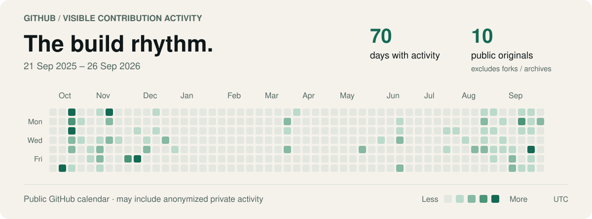

<picture>
  <source media="(prefers-color-scheme: dark) and (max-width: 600px)" srcset="assets/profile/hero-dark-mobile.svg">
  <source media="(max-width: 600px)" srcset="assets/profile/hero-light-mobile.svg">
  <source media="(prefers-color-scheme: dark)" srcset="assets/profile/hero-dark.svg">
  
</picture>

# Tejas Kaushik

I build web and mobile products, AI applications, and the systems that connect them.

**Founding Software Engineer at Anticipation Labs.** Studying Computer Science at Western University with Ivey Advanced Entry Opportunity (AEO), intending to pursue the Computer Science/Ivey HBA dual-degree pathway.

[Portfolio ↗](https://tejass-kaushik.vercel.app/) · [LinkedIn ↗](https://www.linkedin.com/in/tejasskaushik/) · [Email ↗](mailto:tejs.kaushik@outlook.com)

**Explore** &nbsp; [Now](#now) / [Projects](#projects) / [The lab](#the-lab) / [Toolkit](#toolkit) / [Journey](#journey) / [Activity](#activity)

---

## Now

**Anticipation Labs · 2026–present**

Building at the intersection of AI and everyday life. [Anticipy](https://www.anticipy.ai/) is an AI pendant designed to turn spoken intentions into actions with the wearer's approval.

I built and shipped the **Anticipy Fellowship website and application experience**: candidate journeys across Software, Hardware, and Growth/Marketing, application flows, and deployment to Cloudflare Workers with automatic delivery from Git. I also contribute to recruiting infrastructure and early-stage operations.

## Projects

<picture>
  <source media="(prefers-color-scheme: dark) and (max-width: 600px)" srcset="assets/profile/project-atlas-dark-mobile.svg">
  <source media="(max-width: 600px)" srcset="assets/profile/project-atlas-light-mobile.svg">
  <source media="(prefers-color-scheme: dark)" srcset="assets/profile/project-atlas-dark.svg">
  
</picture>

<strong>01 / ACS Can Drive</strong> — coordinating a campaign that collected 27,000+ cans

### ACS Can Drive

A full-stack platform for a school-wide food drive. I built donation leaderboards, roster imports, class-buyout tracking, and street reservations so organizers could coordinate collection in one place. The **campaign** collected 27,000+ cans.

**Inside the build:** React and TypeScript for the organizer interface; FastAPI for campaign records, imports, and reporting. Street reservations connect collection areas with the people responsible for them.

`React` `TypeScript` `FastAPI`

[Explore the repository ↗](https://github.com/tejask-dev/ACS_CanDrive-WebApp) · [Read the reservation logic ↗](https://github.com/tejask-dev/ACS_CanDrive-WebApp/blob/master/backend/routers/map_reservations.py)

<strong>02 / MoleculeAI</strong> — from a molecule drawing to an interactive structure

### MoleculeAI

An organic chemistry application for moving between molecule drawings, names, and interactive structures. I built drawing and name-to-structure workflows, functional-group detection, and 3D visualization.

**Inside the build:** a React interface connects to RDKit for structure analysis and PubChem for compound lookup. The result brings visual exploration and chemistry tooling into the same workflow.

`React` `TypeScript` `FastAPI` `RDKit` `PubChem`

[Explore the interface ↗](https://organic-chem-web-app.vercel.app/) · [Repository ↗](https://github.com/tejask-dev/OrganicChem-WebApp) · [Read the chemistry engine ↗](https://github.com/tejask-dev/OrganicChem-WebApp/blob/main/backend/app/chemistry.py)

<strong>03 / ModelMind</strong> — ask questions of a spreadsheet

### ModelMind

An AI-assisted spreadsheet analysis **prototype**, built during my DocuBridge internship. I developed natural-language questions over Excel and CSV data, alongside structured analysis, charts, and summaries.

**Inside the build:** a React interface connects file processing, Pandas, and LLM APIs through a Flask backend, taking an uploaded spreadsheet into an analysis workflow.

`React` `TypeScript` `Flask` `Pandas` `LLM APIs`

[Explore the internship repository ↗](https://github.com/tejask-dev/Docubridge-Intership) · [Read the analysis backend ↗](https://github.com/tejask-dev/Docubridge-Intership/blob/master/Backend/app.py)

<strong>04 / PromMatch</strong> — compatibility, recommendations, and mutual matches

### PromMatch

An AI-assisted student matchmaking platform. I developed profile and questionnaire flows with ranked recommendations and mutual matches.

**Inside the build:** weighted questionnaire compatibility provides structured scoring; optional embedding similarity compares free-text responses. A FastAPI backend works with PostgreSQL and pgvector.

`React` `FastAPI` `PostgreSQL` `pgvector`

[Explore the interface ↗](https://prom-match.vercel.app/) · [Repository ↗](https://github.com/tejask-dev/PromMatch) · [Read the compatibility engine ↗](https://github.com/tejask-dev/PromMatch/blob/main/backend/app/services/compatibility_engine.py)

## The lab

### RelayPass · consent that travels with the task

What happens to your permissions when one AI agent delegates to another?

[**Explore the architecture ↗**](https://github.com/tejask-dev/Egoist-Ideathon---RelayPass/blob/main/docs/ARCHITECTURE.md) · [Explore the source ↗](https://github.com/tejask-dev/Egoist-Ideathon---RelayPass)

A prototype exploring signed delegation passes, narrower permissions at each handoff, causal receipts, and cascading revocation. **Agents, merchants, and purchases are simulated.**

<strong>Follow a delegation</strong> — permission → handoff → receipt → revocation

1. **Define the boundary.** A signed pass describes the allowed action.
2. **Delegate within it.** A child pass narrows the authority it inherits.
3. **Keep the trail.** Receipts connect the action to its permission chain.
4. **Revoke the branch.** Revocation cascades through descendants.

Built with Next.js, TypeScript, jose, and Zod. The demo explores the consent model; it does not execute real purchases.

[Read the architecture ↗](https://github.com/tejask-dev/Egoist-Ideathon---RelayPass/blob/main/docs/ARCHITECTURE.md)

## Toolkit

| Layer | Tools I use | Where to see them |
| :--- | :--- | :--- |
| Interfaces | React, Next.js, TypeScript, Flutter | Web products, Stellar web and mobile |
| APIs & data | FastAPI, Flask, PostgreSQL, Pandas | ACS Can Drive, ModelMind, PromMatch |
| AI & domain tooling | LLM APIs, embeddings, RDKit, PubChem | ModelMind, PromMatch, MoleculeAI |
| Infrastructure | Cloudflare Workers, Firebase, Redis | Anticipy Fellowship, Stellar |

## Journey

<strong>Stellar Learning</strong> — former CTO, previously Deputy CTO · Aug 2025–Jul 2026

[Stellar](https://stellarlearning.app/) is a free learning and exam-preparation platform reporting **40,000+ learners**. I contributed to platform architecture and product development across web, mobile, and AI-enabled learning, including practice systems and the Nova AI tutoring experience.

My web work involved React, Next.js, Firebase, and Redis. On mobile, I worked with Flutter, Riverpod, GoRouter, Dio, and streaming interfaces. I also coordinated technical work within a distributed volunteer organization.

<strong>Alti AI & DocuBridge</strong> — software engineering and AI internships

**Alti AI · Software Engineering / AI Product Intern · Oct 2025–Apr 2026**

Worked on Alti Assistant and Alti Agent, with safety and guardrail work on Alti Guard.

**DocuBridge · Software Engineering / AI Development Intern · Jul–Aug 2025**

Developed ModelMind, the spreadsheet analysis prototype featured above.

<strong>Beyond the code</strong> — building with clients

I founded a web and software venture through Ontario's Summer Company program, delivering client projects from scoping through development and deployment. That put client conversations and delivery responsibilities alongside the engineering.

## Activity

<a href="https://github.com/tejask-dev?tab=overview">
  <picture>
    <source media="(prefers-color-scheme: dark) and (max-width: 600px)" srcset="assets/profile/activity-dark-mobile.svg">
    <source media="(max-width: 600px)" srcset="assets/profile/activity-light-mobile.svg">
    <source media="(prefers-color-scheme: dark)" srcset="assets/profile/activity-dark.svg">
    
  </picture>
</a>

A dated snapshot of GitHub-visible activity, which may include anonymized private contributions. Intensity is not a commit count. [Data & provenance](data/activity.json) · [Refresh workflow](.github/workflows/profile-activity.yml)

---

## Let's build something useful.

For engineering opportunities, technical collaborations, or a conversation about something you're building:

[**Email me ↗**](mailto:tejs.kaushik@outlook.com) &nbsp; [LinkedIn ↗](https://www.linkedin.com/in/tejasskaushik/) &nbsp; [Portfolio ↗](https://tejass-kaushik.vercel.app/)

[Back to the top ↑](#tejas-kaushik) · [About this profile](docs/PROFILE-DESIGN.md)
