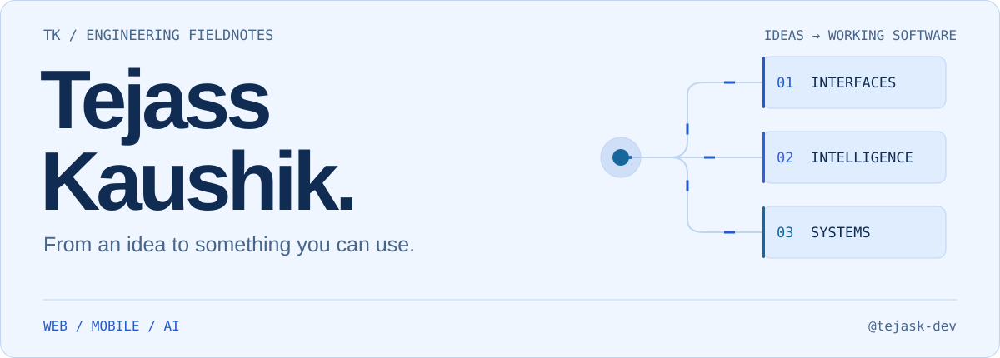
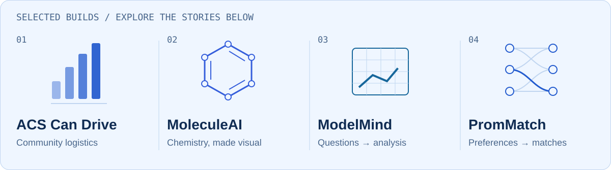
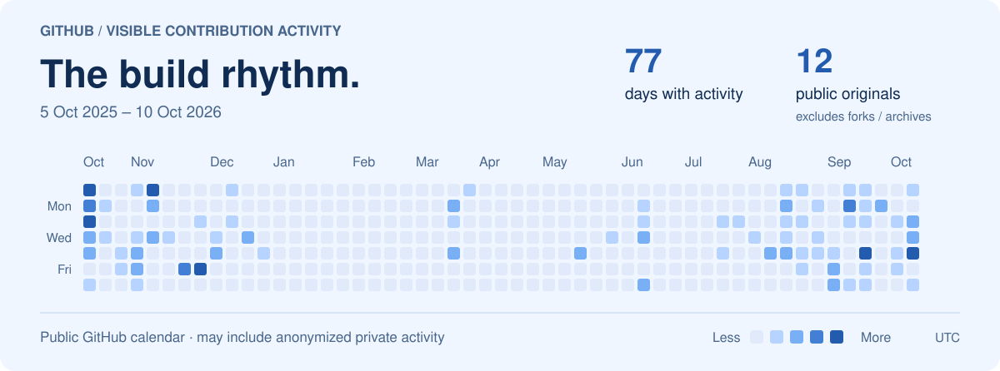

<picture>
  <source media="(prefers-color-scheme: dark) and (max-width: 600px)" srcset="assets/profile/hero-dark-mobile.svg">
  <source media="(max-width: 600px)" srcset="assets/profile/hero-light-mobile.svg">
  <source media="(prefers-color-scheme: dark)" srcset="assets/profile/hero-dark.svg">
  
</picture>

# Hey, I'm Tejass Kaushik.

**Software engineer. Product builder. Curious about how things work.**

I'm a **Founding Software Engineer at Anticipation Labs**, building [Anticipy](https://anticipy.ai/), and the **former CTO of Stellar Learning**. I study **Computer Science at Western University** and hold **Ivey Advanced Entry Opportunity (AEO)** status.

My work spans web and mobile applications, AI workflows, and the systems that connect them. I like taking a problem all the way through: understanding the person using it, building the software, and checking that the experience actually works.

[**Portfolio ↗**](https://tejass-kaushik.vercel.app/) &nbsp; · &nbsp; [Resume ↗](https://tejass-kaushik.vercel.app/resume) &nbsp; · &nbsp; [LinkedIn ↗](https://www.linkedin.com/in/tejasskaushik/) &nbsp; · &nbsp; [Email ↗](mailto:tejas.kaushik@outlook.com)

**Explore** &nbsp; [About](#about-me) / [Now](#now) / [Projects](#projects) / [The lab](#the-lab) / [Toolkit](#toolkit) / [Journey](#journey) / [Activity](#activity)

---

## About me

I'm interested in the places where software meets something beyond a screen: learning, scientific questions, everyday tasks, and connected devices. That has taken me from chemistry tools and spreadsheet analysis to education platforms and an AI wearable.

- **What I build:** interfaces people can navigate, APIs and data workflows behind them, and AI features with clear permissions and useful outputs.
- **How I work:** define the problem, make acceptance criteria concrete, iterate with Claude and Codex, review the result, and test the actual browser or device journey.
- **What I care about:** thoughtful product decisions, understandable systems, and evidence that a feature does what it promises.
- **Beyond engineering:** I co-authored global health research through Youreka Canada. I also love water, boats, and yachts—which explains [Open Water](https://tejass-kaushik.vercel.app/), my interactive portfolio.

## Now

**Anticipation Labs · Founding Software Engineer · Aug 2026–present**

[Anticipy](https://anticipy.ai/) is an AI wearable being built to turn spoken intentions into actions through connected software, with the person's approval. My work covers **connected-app reliability, private AI workflows, release verification, and hands-on phone and prototype wearable testing**.

I set requirements and repair priorities, direct AI-assisted implementation and review, and test the experience on real devices. One example: I prioritized a connection failure and required browser-tested release evidence. The deployed navigation correction reached provider sign-in in those checks.

<strong>A closer look at my contribution</strong> — apps, AI, devices, and delivery

- **Connected apps:** consent and recovery flows, with acceptance checks that follow the browser through to the provider.
- **Private AI:** a preparation prototype that turns a selected source into a brief, with explicit consent, spending, cancellation, and retention boundaries. Validated locally.
- **Devices and releases:** hands-on phone observations and prototype hardware testing, alongside release coordination and review.
- **Fellowship:** the responsive recruiting experience and application navigation. The Fellowship is coming soon.

This builds on the team's existing product, native apps, workflow systems, and hardware designs. Claude and Codex contribute substantially to implementation and review under my direction. The [case study](https://tejass-kaushik.vercel.app/case-studies/anticipy) separates deployed repairs, local prototypes, and ongoing device validation.

[Read the engineering case study ↗](https://tejass-kaushik.vercel.app/case-studies/anticipy) · [Explore Anticipy ↗](https://anticipy.ai/)

## Projects

<picture>
  <source media="(prefers-color-scheme: dark) and (max-width: 600px)" srcset="assets/profile/project-atlas-dark-mobile.svg">
  <source media="(max-width: 600px)" srcset="assets/profile/project-atlas-light-mobile.svg">
  <source media="(prefers-color-scheme: dark)" srcset="assets/profile/project-atlas-dark.svg">
  
</picture>

<strong>01 / ACS Can Drive</strong> — coordinating a campaign that collected 27,000+ cans

### ACS Can Drive

A full-stack platform for a school-wide food drive. I built donation leaderboards, roster imports, class-buyout tracking, and street reservations so organizers could coordinate collection in one place. The **campaign** collected 27,000+ cans.

**Inside the build:** React and TypeScript for the organizer interface; FastAPI for campaign records, imports, and reporting. Street reservations connect collection areas with the people responsible for them.

`React` `TypeScript` `FastAPI`

[Explore the repository ↗](https://github.com/tejask-dev/ACS_CanDrive-WebApp) · [Read the reservation logic ↗](https://github.com/tejask-dev/ACS_CanDrive-WebApp/blob/master/backend/routers/map_reservations.py)

<strong>02 / MoleculeAI</strong> — from a molecule drawing to an interactive structure

### MoleculeAI

An organic chemistry application for moving between molecule drawings, names, and interactive structures. I built drawing and name-to-structure workflows, functional-group detection, and 3D visualization.

**Inside the build:** a React interface connects to RDKit for structure analysis and PubChem for compound lookup. The result brings visual exploration and chemistry tooling into the same workflow.

`React` `TypeScript` `FastAPI` `RDKit` `PubChem`

[Explore the interface ↗](https://organic-chem-web-app.vercel.app/) · [Repository ↗](https://github.com/tejask-dev/OrganicChem-WebApp) · [Read the chemistry engine ↗](https://github.com/tejask-dev/OrganicChem-WebApp/blob/main/backend/app/chemistry.py)

<strong>03 / ModelMind</strong> — ask questions of a spreadsheet

### ModelMind

An AI-assisted spreadsheet analysis **prototype**, built during my DocuBridge internship. I developed natural-language questions over Excel and CSV data, alongside structured analysis, charts, and summaries.

**Inside the build:** a React interface connects file processing, Pandas, and LLM APIs through a Flask backend, taking an uploaded spreadsheet into an analysis workflow.

`React` `TypeScript` `Flask` `Pandas` `LLM APIs`

[Explore the internship repository ↗](https://github.com/tejask-dev/Docubridge-Intership) · [Read the analysis backend ↗](https://github.com/tejask-dev/Docubridge-Intership/blob/master/Backend/app.py)

<strong>04 / PromMatch</strong> — compatibility, recommendations, and mutual matches

### PromMatch

An AI-assisted student matchmaking platform. I developed profile and questionnaire flows with ranked recommendations and mutual matches.

**Inside the build:** weighted questionnaire compatibility provides structured scoring; optional embedding similarity compares free-text responses. A FastAPI backend works with PostgreSQL and pgvector.

`React` `FastAPI` `PostgreSQL` `pgvector`

[Explore the interface ↗](https://prom-match.vercel.app/) · [Repository ↗](https://github.com/tejask-dev/PromMatch) · [Read the compatibility engine ↗](https://github.com/tejask-dev/PromMatch/blob/main/backend/app/services/compatibility_engine.py)

## The lab

### Open Water · a portfolio you can explore

An interactive ocean, a yacht, a scuba descent, and a straightforward reading experience underneath it all. It brings together my engineering work and my love of the water. The projects and contact information remain available without JavaScript or compatible graphics.

I directed the experience and acceptance criteria; Codex and Claude contributed implementation, artwork, and review. Built with **React, TypeScript, and Three.js**, with reduced-motion support and an alternative field guide.

[**Explore Open Water ↗**](https://tejass-kaushik.vercel.app/) · [Read the source ↗](https://github.com/tejask-dev/personal-portfolio)

### RelayPass · consent that travels with the task

What happens to your permissions when one AI agent delegates to another?

[**Explore the architecture ↗**](https://github.com/tejask-dev/Egoist-Ideathon---RelayPass/blob/main/docs/ARCHITECTURE.md) · [Explore the source ↗](https://github.com/tejask-dev/Egoist-Ideathon---RelayPass)

A prototype built with Claude, exploring signed delegation passes, narrower permissions at each handoff, causal receipts, and cascading revocation. **Agents, merchants, and purchases are simulated.**

<strong>Follow a delegation</strong> — permission → handoff → receipt → revocation

1. **Define the boundary.** A signed pass describes the allowed action.
2. **Delegate within it.** A child pass narrows the authority it inherits.
3. **Keep the trail.** Receipts connect the action to its permission chain.
4. **Revoke the branch.** Revocation cascades through descendants.

Built with Next.js, TypeScript, jose, and Zod. The demo explores the consent model; it does not execute real purchases.

[Read the architecture ↗](https://github.com/tejask-dev/Egoist-Ideathon---RelayPass/blob/main/docs/ARCHITECTURE.md)

## Toolkit

| Area | Tools I work with |
| :--- | :--- |
| Languages | Python, TypeScript, JavaScript, SQL |
| Web & mobile | React, Next.js, Flutter, Three.js |
| APIs & data | FastAPI, Flask, PostgreSQL, Pandas, pgvector |
| AI & scientific tooling | LLM APIs, embeddings, RDKit, PubChem |
| Delivery | Git, GitHub Actions, Cloudflare Workers, Firebase, Redis |

I choose the stack around the problem and the people using the result.

## Journey

<strong>Stellar Learning</strong> — former CTO, previously Deputy CTO · Aug 2025–Jul 2026

[Stellar](https://stellarlearning.app/) is a volunteer-built learning and exam-preparation platform. I developed the **IB Diploma question-generation and practice harnesses**, and improved the **AP question and lesson harnesses**.

The platform reports **40,000+ learners**; that is an organization-wide figure. [Read about my part in the platform ↗](https://tejass-kaushik.vercel.app/case-studies/stellar-learning)

<strong>Youreka Canada</strong> — published global health research · 2025

I co-authored a study of adolescent fertility and pediatric HIV treatment coverage across **34 Sub-Saharan African countries**, alongside Liyona Wang, Shikai Jin, and Elijah Murtagh.

The study was published in the **2025 Youreka Canada Journal** and recognized there as the **national first-place study**. The research and recognition belong to our team. The study examines an association in country-level data, rather than establishing a causal relationship.

[Read the research story ↗](https://tejass-kaushik.vercel.app/case-studies/global-health-research) · [Final journal ↗](https://drive.google.com/file/d/1lTrTsLfvYSEkUlYoGWTSYcoekdeiJqu4/view)

<strong>Alti AI & DocuBridge</strong> — software engineering and AI internships

**Alti AI · Software Engineering / AI Product Intern · Oct 2025–Apr 2026**

Worked on Alti Assistant and Alti Agent, with safety and guardrail work on Alti Guard.

**DocuBridge · Software Engineering Intern · Jul–Aug 2025**

Developed ModelMind, the spreadsheet analysis prototype featured above.

<strong>Beyond the code</strong> — building with clients

I founded a web and software venture through Ontario's Summer Company program, delivering client projects from scoping through development and deployment. That put client conversations and delivery responsibilities alongside the engineering.

## Activity

<a href="https://github.com/tejask-dev?tab=overview">
  <picture>
    <source media="(prefers-color-scheme: dark) and (max-width: 600px)" srcset="assets/profile/activity-dark-mobile.svg">
    <source media="(max-width: 600px)" srcset="assets/profile/activity-light-mobile.svg">
    <source media="(prefers-color-scheme: dark)" srcset="assets/profile/activity-dark.svg">
    
  </picture>
</a>

A dated snapshot of GitHub-visible activity, which may include anonymized private contributions. Intensity is not a commit count. [Data & provenance](data/activity.json) · [Refresh workflow](.github/workflows/profile-activity.yml)

---

## Let's build something useful.

For engineering opportunities, technical collaborations, or a conversation about something you're building:

[**Email me ↗**](mailto:tejas.kaushik@outlook.com) &nbsp; [LinkedIn ↗](https://www.linkedin.com/in/tejasskaushik/) &nbsp; [Portfolio ↗](https://tejass-kaushik.vercel.app/) &nbsp; [Resume ↗](https://tejass-kaushik.vercel.app/resume)

[Back to the top ↑](#hey-im-tejass-kaushik) · [About this profile](docs/PROFILE-DESIGN.md)
